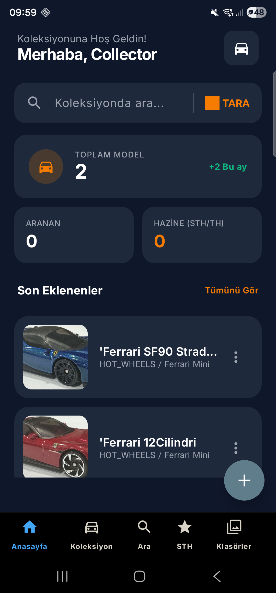
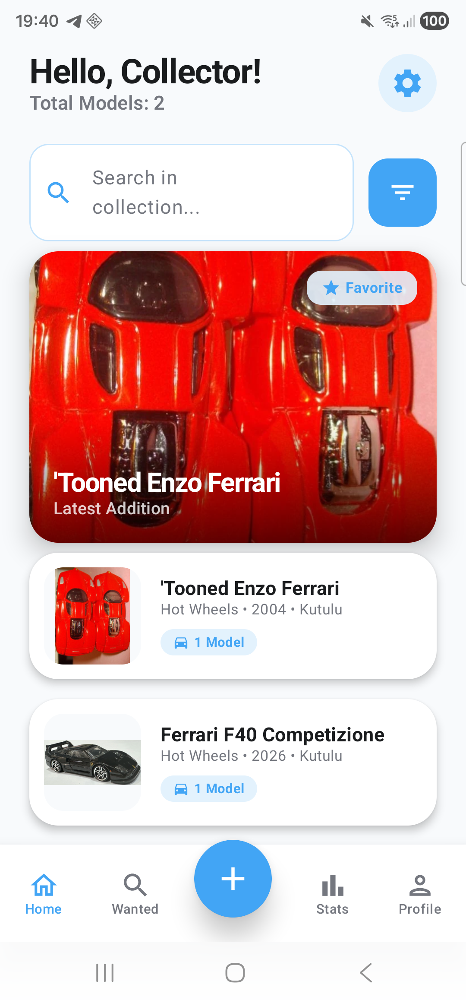

  
  <h1>BaseHW - Model Car Collector's Vault 🏎️</h1>
  
  

    <b>Deutsch</b> • 
    <a href="README.md">English</a> • 
    <a href="README_tr.md">Türkçe</a>
  

  
  
  

---

**BaseHW** ist eine hochmoderne Android-Anwendung, die speziell für Diecast-Sammler entwickelt wurde. Erstellt mit **Jetpack Compose** und **Clean Architecture (MVVM)**, bietet sie ein erstklassiges Erlebnis zur Verwaltung, Synchronisierung und Entdeckung Ihrer Modellautosammlung.

## 📸 Visuelle Präsentation

   &nbsp; &nbsp;
  

## 🌟 Hauptmerkmale
- **🎨 High-Fidelity UI/UX:** Von der Natur inspiriertes Designsystem in Creme/Olivgrün mit moderner Typografie und flüssigen Animationen.
- **🔄 Cloud-Sync & Auth:** Nahtlose Google-Anmeldung über den Credential Manager. Sofortiges Cloud-Backup mit Firebase Firestore und Supabase.
- **📡 Remote-Katalog-Synchronisierung:** Aktualisieren Sie Ihre Fahrzeugdatenbank ohne App-Update! Verwendet GitHub-gehostete JSON-Kataloge für Modell-Updates in Echtzeit.
- **📊 Statistiken & Einblicke:** Tauchen Sie tief in Ihre Sammlungsstatistiken ein (Markenverteilung, Boxzustand, Marktwert).
- **📋 Verwaltung:** Integriertes "Gesucht"-System (Wunschliste) mit Unterstützung für hochauflösende Bilder über Supabase Storage.

## 🛠️ Tech Stack
- **Kern:** Kotlin 2.0, Jetpack Compose, Coroutines, Flow.
- **Architektur:** MVVM, Clean Architecture.
- **DI / DB:** Hilt, Room Database, Paging 3.
- **Backend:** Firebase (Auth/Firestore), Supabase (Postgres/Storage).

## 📜 Rechtliches
- 🔒 **[Datenschutzrichtlinie](docs/privacy.html)**
- 📝 **[Nutzungsbedingungen](docs/terms.html)**

---

## 🚀 Installation & Einrichtung
1. Klonen Sie das Repository.
2. Fügen Sie Ihre `google-services.json` zum Verzeichnis `app/` hinzu.
3. Aktualisieren Sie `default_web_client_id` in `strings.xml`.
4. Erstellen Sie die App in **Android Studio Meerkat** oder neuer.

---

  Developed with ❤️ by <b>ttimocin</b>

