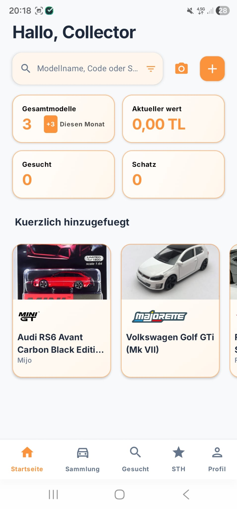
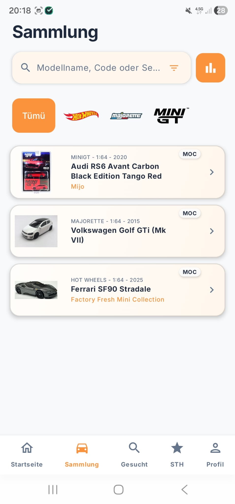
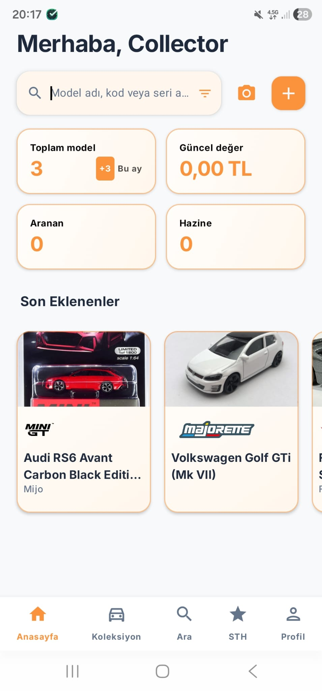

  
  <h1>BaseHW - Premium Diecast Collector's Vault 🏎️</h1>
  
  

    <b>Deutsch</b> • 
    <a href="README.md">English</a> • 
    <a href="README_tr.md">Türkçe</a>
  

  
  
  

---

**BaseHW** ist der ultimative, hochmoderne Android-Begleiter für leidenschaftliche Diecast-Autosammler. Mit **Jetpack Compose** und konsequenter **Clean Architecture (MVVM)** von Grund auf neu gestaltet, bietet die App ein erstklassiges Premium-Erlebnis. Sammeln, synchronisieren und entdecken Sie Ihre gesamte Modellautosammlung ganz einfach. Von der sofortigen Cloud-Synchronisierung bis hin zur fortschrittlichen KI-gestützten Texterkennung revolutioniert BaseHW die Art und Weise, wie Sammler ihre Leidenschaft verwalten.

## 📸 Visuelle Präsentation
*Eine komplett neugestaltete, von der Natur inspirierte Benutzeroberfläche.*

   &nbsp;
   &nbsp;
  

## 🌟 Funktionen der nächsten Generation

- **💡 ML Kit Smart OCR:** Fügen Sie im Handumdrehen neue Autos zu Ihrer Sammlung hinzu – direkt über Ihre Kamera! Unsere hochentwickelte, KI-gesteuerte Texterkennung liest Modellnamen vollautomatisch von der Originalverpackung ab.
- **🎨 Hochwertiges Premium UI/UX:** Ein maßgeschneidertes, von der Natur inspiriertes Designsystem in Creme/Olivgrün. Moderne Typografie, ansprechende Glassmorphismus-Effekte und dynamische Mikro-Animationen sorgen für ein unverkennbares Erlebnis.
- **🏎️ Ultra-Marken-Support:** Wir bieten mehr als nur die Basics! Verwalten Sie Ihre Sammlungen jetzt für High-End-Marken wie **Hot Wheels, Matchbox, Majorette, MiniGT, Inno64, Tarmac Works und Kaido House**.
- **🔄 Sichere Cloud-Synchronisierung & Auth:** Nahtlose One-Tap-Google-Anmeldung via Credential Manager. Zuverlässiges Echtzeit-Cloud-Backup über alle Ihre Geräte hinweg, betrieben durch Firebase Firestore und **Supabase** (Postgres/Storage).
- **📡 Over-The-Air (OTA) Katalog-Updates:** Erweitern Sie Ihre Fahrzeugdatenbank jederzeit und ohne neue App-Updates. Wir nutzen GitHub-basierte JSON-Kataloge, um brandneue Modelle in Echtzeit direkt in Ihre App zu laden.
- **📊 Erweiterte Statistiken:** Tiefgehende Einblicke in Ihre Sammlung! Visualisieren Sie Ihre Markenverteilung, erfassen Sie den genauen Kartonzustand und überwachen Sie den Gesamtmarktwert Ihrer kostbaren Modelle.
- **📋 Hochauflösende Wunschliste:** Ein natives "Wanted"-System, das direkt mit Supabase Storage verbunden ist. So wird sichergestellt, dass Sie Ihre Traumautos in bester Bildqualität auf Ihrer Liste verwalten können.

## 🛠️ Technologie-Stack & Architektur
BaseHW präsentiert die modernsten Android-Entwicklungsstandards:
- **Kerntechnologien:** Kotlin 2.0, Jetpack Compose, Coroutines, Flow.
- **Architektur:** MVVM mit streng angewandten Clean-Architecture-Prinzipien.
- **Lokale Datenbank & DI:** Hilt für reibungslosere Dependency Injection, Room Database für Offline-Caching und schnelles Paging 3 für unendliches Scrollen.
- **Backend-Infrastruktur:** Eine leistungsstarke Kombination aus Firebase (Auth, Firestore) und Supabase (Postgres, Storage) bietet höchste Skalierbarkeit für Ihre Daten.
- **KI & Bildverarbeitung:** Google ML Kit (Texterkennung) und uCrop zur Bildbearbeitung. Effizientes Laden und Cachen von Bildern mittels Coil.

## 🚀 Installation & Einrichtung
1. Klonen Sie das Repository auf Ihren lokalen Rechner: `git clone https://github.com/ttimocin/basehw.git`
2. Fügen Sie Ihre `google-services.json` sicher in das Verzeichnis `app/` ein.
3. Aktualisieren Sie `default_web_client_id` in der Datei `strings.xml`, um sie an Ihr entsprechendes Google Cloud-Projekt anzupassen.
4. Öffnen und kompilieren Sie die App mit **Android Studio Meerkat** (oder neuer), um die Vorschaufunktionen von Compose vollumfänglich zu nutzen.

## 📜 Rechtliches & Ressourcen
- 🔒 **[Datenschutzrichtlinie](https://ttimocin.github.io/basehw/privacy.html)**
- 📝 **[Nutzungsbedingungen](https://ttimocin.github.io/basehw/terms.html)**
- 🗑️ **[Kontolöschung](https://ttimocin.github.io/basehw/delete-account.html)**

---

  Mit ❤️ entwickelt für die Sammler-Community von <b>ttimocin</b>

