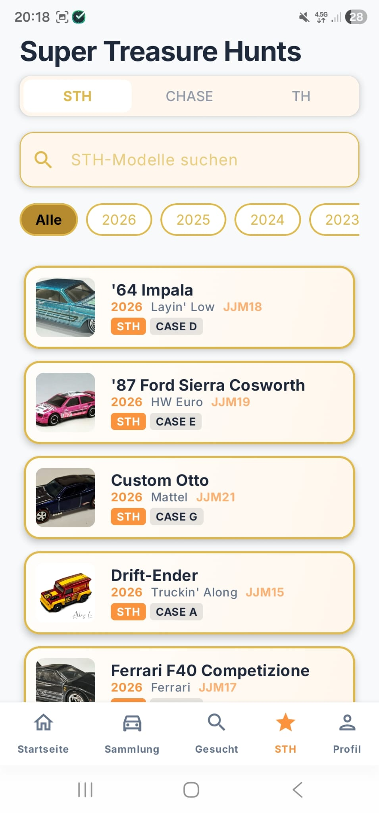
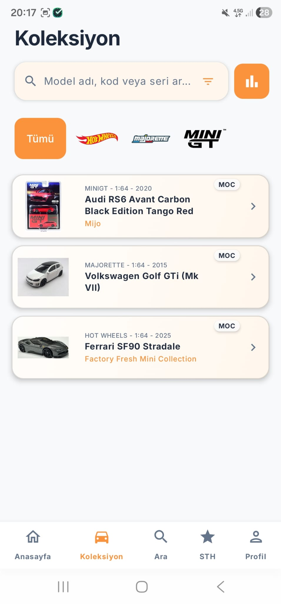
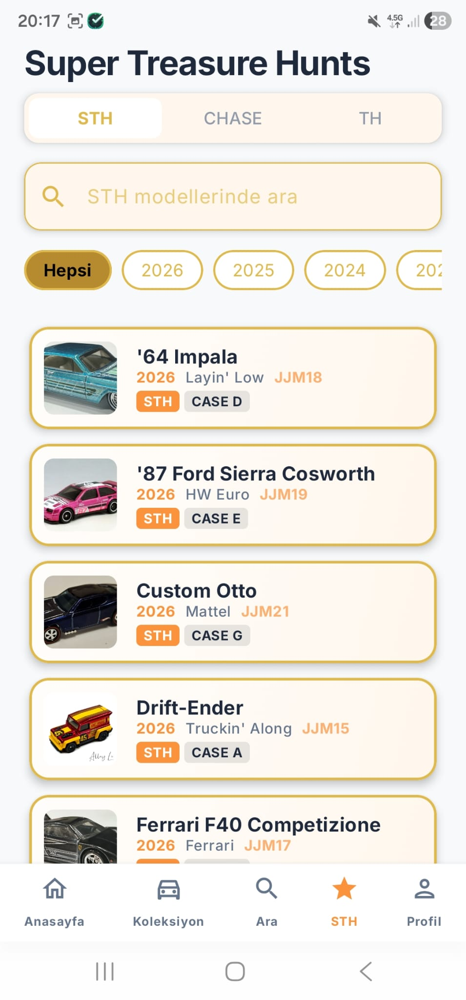

  
  <h1>BaseHW - Premium Diecast Collector's Vault 🏎️</h1>
  
  

    <b>Türkçe</b> • 
    <a href="README.md">English</a> • 
    <a href="README_de.md">Deutsch</a>
  

  
  
  

---

**BaseHW**, diecast ve model araba tutkunları için özel olarak geliştirilmiş modern, premium bir Android uygulamasıdır. **Jetpack Compose** ve **Clean Architecture (MVVM)** standartlarıyla baştan aşağı yenilenmiş olan bu uygulama, koleksiyonunuzu dijitalleştirmek, bulutta güvenle saklamak ve yepyeni modelleri keşfetmek için mükemmel bir deneyim sunar. Gelişmiş yapay zeka destekli metin tanıma sistemlerinden, anlık bulut senkronizasyonuna kadar BaseHW, koleksiyonerlerin ihtiyacı olan her şeye sahiptir.

## 📸 Görsel Tanıtım
*Tamamen yenilenmiş, doğadan ilham alan ve özenle hazırlanmış kullanıcı arayüzü.*

   &nbsp;
   &nbsp;
  

## 🌟 Yeni Nesil Özellikler

- **💡 ML Kit Akıllı OCR:** Kameranızı kullanarak kasanıza yeni araçlar eklemek artık çok kolay! Yapay zeka destekli metin tanıma teknolojimiz, model isimlerini doğrudan fiziksel paketin üzerinden otomatik olarak okur.
- **🎨 Eşsiz Premium UI/UX Deneyimi:** Doğadan ilham alan Krem/Zeytin Yeşili renk paleti, modern tipografi, estetik cam efekti (glassmorphism) detayları ve akıcı mikro animasyonlarla zenginleştirilmiş baştan aşağı yeni bir tasarım sistemi.
- **🏎️ Genişletilmiş Marka Desteği:** Sadece temel markalarla sınırlı değil! Eklenen yeni markalarla birlikte **Hot Wheels, Matchbox, Majorette, MiniGT, Inno64, Tarmac Works ve Kaido House** gibi premium markaları kendi kütüphanenizde yönetin.
- **🔄 Güvenli Bulut Senkronizasyonu:** Credential Manager ile tek dokunuşla kesintisiz Google Girişi. Firebase Firestore ve **Supabase** (Postgres/Storage) altyapısı sayesinde verileriniz cihazlar arası anında yedeklenir.
- **📡 Kesintisiz (OTA) Katalog Güncellemesi:** Uygulama güncellemesine ihtiyaç duymadan yeni çıkan modelleri anında veritabanınıza ekleyin. GitHub tabanlı JSON katalogları sayesinde gerçek zamanlı veri akışı sağlanır.
- **📊 Gelişmiş İstatistikler ve Analizler:** Koleksiyonunuza dair detaylı istatistik grafikleri! Marka dağılımınızı, kutu kondisyonlarınızı takip edin ve koleksiyonunuzun toplam piyasa değerini analiz edin.
- **📋 Yüksek Çözünürlüklü Arananlar (Wishlist):** Supabase Storage gücüyle entegre çalışan, hayalinizdeki yüksek çözünürlüklü araç görsellerini kolayca takip edebileceğiniz yerleşik "Arananlar" listesi sistemi.

## 🛠️ Mimari ve Teknoloji Yığını
BaseHW, en güncel Android geliştirme standartlarının bir vitrinidir:
- **Çekirdek:** Kotlin 2.0, Jetpack Compose, Coroutines, Flow.
- **Mimari Altyapı:** Katı Clean Architecture prensipleriyle yapılandırılmış MVVM yaklaşımı.
- **Veritabanı ve DI:** Güçlü bağımlılık enjeksiyonu için Hilt, çevrimdışı çalışma ve önbellekleme için Room Database, sonsuz kaydırma performansı için Paging 3.
- **Backend:** Ölçeklenebilirlik için harmanlanmış Firebase (Auth, Firestore) ve Supabase (Postgres, Storage) kombinasyonu.
- **Yapay Zeka ve Görsel:** Google ML Kit (Metin Tanıma) ve görsel işleme için uCrop. Coil ile optimize edilmiş görsel yükleme.

## 🚀 Kurulum ve Yapılandırma
1. Projeyi bilgisayarınıza klonlayın: `git clone https://github.com/ttimocin/basehw.git`
2. Kendi `google-services.json` dosyanızı güvenli bir şekilde `app/` dizinine yerleştirin.
3. `strings.xml` dosyasındaki `default_web_client_id` alanını kendi Google Cloud projenize uygun şekilde güncelleyin.
4. Compose önizlemelerinden tam anlamıyla faydalanmak için **Android Studio Meerkat** (veya daha yeni) bir sürümle projeyi derleyin.

## 📜 Hukuki Bilgiler
- 🔒 **[Gizlilik Politikası](https://ttimocin.github.io/basehw/privacy.html)**
- 📝 **[Kullanım Koşulları](https://ttimocin.github.io/basehw/terms.html)**
- 🗑️ **[Hesap Silme](https://ttimocin.github.io/basehw/delete-account.html)**

---

  Koleksiyoner topluluğu için sevgiyle ❤️ <b>ttimocin</b> tarafından geliştirildi.

